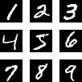

# MNIST_PCA

Linear algebra class project: PCA(2D) Classification implementation for MNIST.#

## Contents

- [MNIST\_PCA](#mnist_pca)
  - [Contents](#contents)
  - [Introduction](#introduction)
    - [Model Setup](#model-setup)
  - [Results](#results)
  - [Installation](#installation)
    - [Prerequisites](#prerequisites)
    - [Running the Project](#running-the-project)

## Introduction

MNIST is a well-known dataset in the field of machine learning, consisting of handwritten digits (0-9). It is widely used for benchmarking classification algorithms. This project implements Principal Component Analysis (PCA) to reduce the dimensionality of the MNIST dataset and compare the performance of different neural network architectures, as well as implementing 2-dimensional PCA and further comparing the results with the original dataset.



### Model Setup

PCA, Principal Component Analysis, is a technique used to reduce the dimensionality of data while preserving as much variance as possible. 2D PCA extends this idea to two dimensions, allowing us preserve row/column relationships while reducing dimensionality. When using PCA on images, as pixels have the same range of values, we can only normalize the data to have zero mean, while the variance is preserved.

In this project, we use fully connected neural networks (NN) and Convolutional Neural Networks (CNN) to classify the MNIST dataset before and after applying PCA. The goal is to evaluate how PCA affects the performance of these models.

Fully connected neural networks treat each pixel independently and use linear transformations followed by non-linear activation functions. In contrast, convolutional neural networks use convolution operations that exploit spatial locality - they consider the relationships between neighboring pixels. This architectural difference makes CNNs more suitable for image data, but also means they may be more sensitive to the spatial information loss that occurs during PCA dimensionality reduction. Thus we can observe the difference in performance between the two models when PCA is applied.

We also implement 2D PCA to see if we can reduce the loss of spatial information while still achieving good classification performance and allow for sizeable dimensionality reduction. By comparing the results of 2D PCA with those of PCA, we can gain insights into the effectiveness of different dimensionality reduction techniques in preserving important features of the data.

## Results


## Installation

### Prerequisites

This project has its environment managed by [uv](https://docs.astral.sh/uv/). Run `uv --version` to check if you have it installed.

If not you can refer to [uv installation guide](https://docs.astral.sh/uv/getting-started/installation/).

### Running the Project

1. Clone the repository:

```bash
git clone https://github.com/Frank0415/MNIST_PCA.git
cd MNIST_PCA
```

2. Run the main.py script using uv:

```bash
uv run main.py
```
